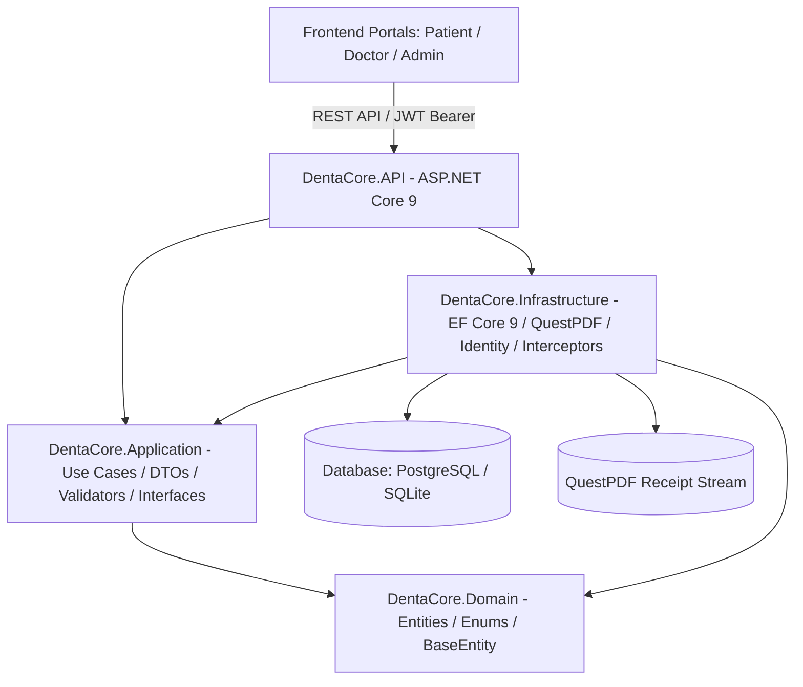
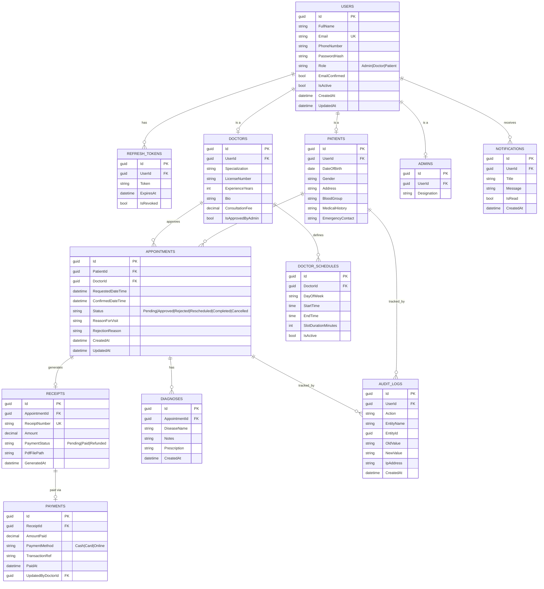
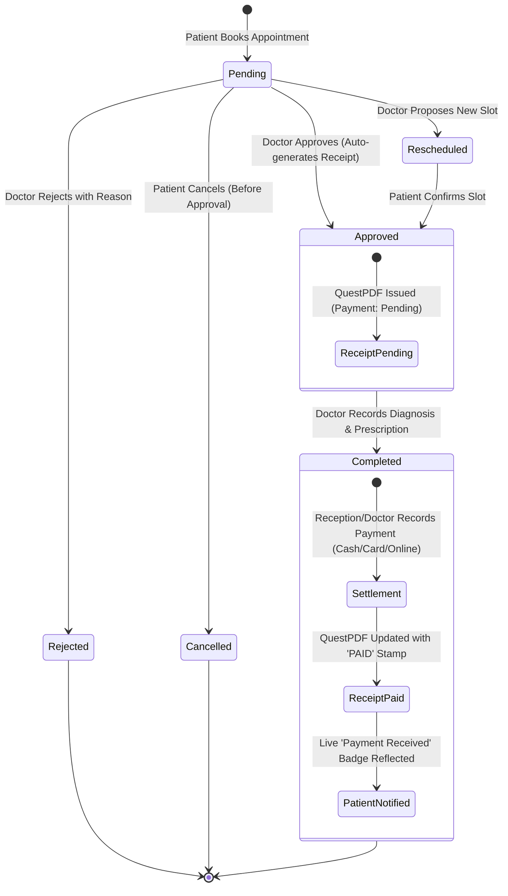

# DentaCore — Dental Management Portal


**DentaCore** is a modern, clinical-grade dental practice management platform built on **.NET 9** following **Clean Architecture** principles. It streamlines the full patient visit lifecycle: doctor schedule browsing, real-time 30-minute slot availability, appointment approvals, clinical diagnosis recording, QuestPDF receipt generation, live payment settlement with instant patient notifications, and an automated tamper-evident audit trail.

---

## Table of Contents

- [System Architecture](#system-architecture)
- [Entity Relationship Diagram (ERD)](#entity-relationship-diagram-erd)
- [Project Structure](#project-structure)
- [Key Features by Role](#key-features-by-role)
- [Appointment & Billing Lifecycle](#appointment--billing-lifecycle)
- [Technology Stack](#technology-stack)
- [Database Configuration & .env](#database-configuration--env)
- [Default Seeded Credentials](#default-seeded-credentials)
- [Getting Started](#getting-started)
- [REST API Endpoints Reference](#rest-api-endpoints-reference)
- [Running Tests](#running-tests)

---

## System Architecture

DentaCore strictly separates domain rules from persistence, frameworks, and presentation layers:



### Business Rules & Interceptors
1. **Automated Audit Trail (`AuditLogSaveChangesInterceptor`)**: Every state mutation across `Appointments`, `Payments`, `Receipts`, `Diagnoses`, and `Users` automatically serializes previous and updated values into immutable `AuditLogs` alongside user identity and client IP address.
2. **Double-Booking Prevention**: Available slots are dynamically computed from active `DoctorSchedules` minus conflicting bookings.
3. **Soft Deletions**: Medical and financial records are never hard-deleted; soft delete is applied globally via EF Core query filters (`!e.IsDeleted`).
4. **Sequential Traceable Receipts**: Canonical identifier format `RCPT-yyyyMMdd-XXXX` generated by `ReceiptNumberGenerator`.
5. **Row-Level Security**: Doctor queues and logs are scoped by `DoctorId`, patient records by `PatientId`, with system-wide administrative oversight.

---

## Entity Relationship Diagram (ERD)

The data model enforces relational integrity, Clean Architecture domain isolation, and comprehensive auditability across the clinical practice workflow:



### Entity Relationship Design Highlights
- **Normalized Authentication & Profiles**: `Users` is the unified security identity table (managing email, password hashes, and roles). `Patients`, `Doctors`, and `Admins` are 1:1 profile extension tables, ensuring identity concerns are decoupled from medical and professional profiles.
- **Automated Audit Logs**: `AuditLogs` captures serialized `OldValue` and `NewValue` snapshots for state mutations across appointments, medical diagnoses, users, receipts, and payments.
- **Separation of Invoices & Payments**: An appointment approval generates a `Receipt` with an initial `Pending` status. Actual financial settlement is recorded in `Payments`, allowing future support for partial settlements, split payment methods, or refund auditing without altering appointment data.

---

## Project Structure

```
DentaCore/
├── DentaCore.sln
├── .env                              # Environment secrets (gitignored)
├── .env.example                      # Template environment variables
├── .gitignore                        # Git ignore rules for .NET & SQLite
│
├── src/
│   ├── DentaCore.Domain/             # Pure domain entities & enums
│   │   ├── Common/                   # BaseEntity, IAuditable, ISoftDeletable
│   │   ├── Entities/                 # User, Patient, Doctor, Admin, Appointment, Diagnosis, Receipt, Payment, DoctorSchedule, AuditLog, Notification, RefreshToken
│   │   └── Enums/                    # UserRole, AppointmentStatus, PaymentStatus, PaymentMethod
│   │
│   ├── DentaCore.Shared/             # Cross-cutting constants & helpers
│   │   ├── Constants/                # AppRoles, PolicyNames, ErrorCodes
│   │   └── Helpers/                  # ReceiptNumberGenerator (RCPT-yyyyMMdd-XXXX)
│   │
│   ├── DentaCore.Application/        # Application business logic
│   │   ├── Common/                   # Result<T>, PagedResult<T>, ICurrentUserService
│   │   ├── Interfaces/               # IApplicationDbContext, IJwtTokenService, IPasswordHasher, IPdfReceiptService, INotificationService
│   │   ├── DTOs/                     # Auth, Doctor, Patient, Appointment, Diagnosis, Receipt, Audit, Notification DTOs
│   │   ├── Validators/               # FluentValidation rules for incoming requests
│   │   └── Extensions/               # ServiceCollectionExtensions
│   │
│   ├── DentaCore.Infrastructure/     # Persistence & external implementations
│   │   ├── Persistence/              # ApplicationDbContext, DatabaseSeeder
│   │   ├── Interceptors/             # AuditLogSaveChangesInterceptor
│   │   ├── Identity/                 # PBKDF2 PasswordHasher
│   │   ├── Services/                 # JwtTokenService, QuestPdfReceiptService, NotificationService
│   │   └── Extensions/               # ServiceCollectionExtensions (PostgreSQL / SQLite toggle)
│   │
│   └── DentaCore.API/                # ASP.NET Core 9 Web API & Host
│       ├── Controllers/              # Auth, Doctors, Patients, Appointments, Receipts, Admin, AuditLogs, Notifications
│       ├── Middleware/               # GlobalExceptionHandlerMiddleware (RFC 7807 ProblemDetails)
│       ├── Services/                 # CurrentUserService
│       ├── wwwroot/                  # Serves Frontend Portals directly from API
│       ├── Program.cs                # Web bootstrap, JWT bearer, Swagger, CORS, Seeder
│       └── appsettings.json
│
├── frontend/                         # Single-Page Application & Portals
│   ├── index.html                    # Landing page with Three.js 3D molar & GSAP animations
│   ├── login.html                    # Multi-role login & patient self-registration modal
│   ├── patient/index.html            # Patient portal (Doctor browser, slot picker, live payment badge)
│   ├── doctor/index.html             # Doctor portal (Approval queue, diagnosis, settlement, schedules)
│   └── admin/index.html              # Admin portal (Doctor credentialing, revenue ledger, global audit)
│
└── tests/
    └── DentaCore.UnitTests/          # xUnit test suite
        └── CoreLogicTests.cs         # PasswordHasher & ReceiptNumberGenerator tests
```

---

## Key Features by Role

### 👤 Patient Portal (`/patient/index.html`)
- **Doctor Directory**: Browse active specialists by specialization, hourly consultation fee, and bio.
- **Real-Time Slot Engine**: Pick any clinic date to view dynamically computed 30-minute available slots.
- **Booking & Lifecycle Tracking**: Request appointments with automatic double-booking prevention.
- **Clinical Summary**: View conditions diagnosed by the doctor along with detailed prescriptions.
- **Live Payment Feedback**: Instant emerald `PAID` badge when reception/doctor records settlement.
- **PDF Invoices**: Download official QuestPDF clinical receipts with practice header and stamps.
- **Medical Profile**: Manage personal medical history, blood group, allergies, and emergency contact.

### 🩺 Doctor Portal (`/doctor/index.html`)
- **Consultation Queue**: Filter incoming visits by `Pending`, `Approved`, `Today`, and `Completed`.
- **One-Click Approval / Rejection**: Approve visits with confirmed timestamps (auto-generating receipts) or decline with required rationale.
- **Clinical Diagnosis**: Record disease name, clinical notes, and prescription directly into visit records.
- **Payment Settlement**: Record payments (Cash / Card / Online with Transaction Ref), triggering receipt re-stamping as `PAID`.
- **Schedule Management**: Configure weekly clinic hours (Monday–Friday) and custom slot durations.
- **Scoped Audit Trail**: View historical audit records of actions tied to the attending doctor's visits.

### 🛡️ Admin Portal (`/admin/index.html`)
- **Doctor Credentialing**: Review and approve new doctor accounts (`IsApprovedByAdmin`) or toggle active/suspended status.
- **Practice Analytics**: Real-time revenue totals (collected vs. pending receivables), patient counts, and visit volume.
- **Master Appointment Ledger**: Comprehensive search and status filtering across all practice appointments.
- **Financial Reconciliation**: System-wide receipts register with download links.
- **Global Audit Trail**: Immutable system-wide log entries displaying user, action, entity, IP address, and JSON before/after snapshots.

---

## Appointment & Billing Lifecycle



---

## Technology Stack

| Layer | Technology |
|---|---|
| **Framework** | .NET 9.0 (C# 13) |
| **API** | ASP.NET Core 9 Web API Controllers |
| **ORM** | Entity Framework Core 9.0 |
| **Database** | PostgreSQL (`Npgsql.EntityFrameworkCore.PostgreSQL`) + SQLite (`Microsoft.EntityFrameworkCore.Sqlite`) fallback |
| **Authentication** | JWT Bearer (`Microsoft.AspNetCore.Authentication.JwtBearer`) + Refresh Token Rotation |
| **Password Hashing** | Cryptographic PBKDF2 with SHA-256 and unique 128-bit salt |
| **PDF Generation** | QuestPDF 2025 (Community License) |
| **Validation** | FluentValidation 11 |
| **API Documentation** | OpenAPI / Swagger UI (`Swashbuckle.AspNetCore 7.2`) |
| **Frontend** | Vanilla CSS, Three.js (3D Molar Scene), GSAP animations |
| **Testing** | xUnit, .NET Test SDK |

---

## Database Configuration & .env

DentaCore supports both **PostgreSQL** and **SQLite** through configuration toggling. On startup, DentaCore loads `.env` automatically.

Example `.env` file (included in project root):

```ini
# Database Provider: "SQLite" or "PostgreSQL"
DATABASE_PROVIDER=SQLite

# PostgreSQL connection string (active when DATABASE_PROVIDER=PostgreSQL)
POSTGRES_CONNECTION=Host=localhost;Port=5432;Database=dentacore_db;Username=dentacore_user;Password=YourStrongPassword123!;

# SQLite fallback (active when DATABASE_PROVIDER=SQLite)
SQLITE_CONNECTION=Data Source=dentacore.db

# JWT Configuration
JWT_SECRET=YourSuperSecretKeyThatIsAtLeast32CharactersLong!!
JWT_ISSUER=DentaCore
JWT_AUDIENCE=DentaCoreApp
JWT_ACCESS_TOKEN_EXPIRY_MINUTES=60
JWT_REFRESH_TOKEN_EXPIRY_DAYS=7

# Default Seeded Admin
ADMIN_FULLNAME=System Administrator
ADMIN_EMAIL=admin@dentacore.local
ADMIN_PASSWORD=Admin@12345!
ADMIN_PHONE=+1234567890

# Default Seeded Doctor
DOCTOR_FULLNAME=Dr. Demo Doctor
DOCTOR_EMAIL=doctor@dentacore.local
DOCTOR_PASSWORD=Doctor@12345!
DOCTOR_PHONE=+0987654321
DOCTOR_SPECIALIZATION=General Dentistry
DOCTOR_LICENSE=DDS-00001
DOCTOR_FEE=150.00
```

---

## Default Seeded Credentials

When starting with a clean database, DentaCore automatically seeds the following verified accounts:

| Role | Email | Password | Access Level |
|---|---|---|---|
| **Admin** | `admin@dentacore.local` | `Admin@12345!` | Full Practice Management, Approvals, Global Audits |
| **Doctor** | `doctor@dentacore.local` | `Doctor@12345!` | Queue, Diagnoses, Settlements, Schedules |
| **Patient** | `patient@dentacore.local` | `Patient@12345!` | Doctor Browsing, Slot Booking, Receipt Downloads |

*Note: The login page (`/login.html`) includes **Instant Demo Login Buttons** that auto-fill these credentials with a single click.*

---

## Getting Started

### Prerequisites
- [.NET 9.0 SDK](https://dotnet.microsoft.com/download/dotnet/9.0) installed.

### 1. Build Solution
```bash
dotnet build DentaCore.sln
```

### 2. Run Test Suite
```bash
dotnet test DentaCore.sln
```

### 3. Launch the Application
```bash
dotnet run --project src/DentaCore.API/DentaCore.API.csproj --urls "http://localhost:5000"
```

### 4. Access the Application
- **Landing Page**: [http://localhost:5000](http://localhost:5000)
- **Sign In / Registration**: [http://localhost:5000/login.html](http://localhost:5000/login.html)
- **Patient Portal**: [http://localhost:5000/patient/index.html](http://localhost:5000/patient/index.html)
- **Doctor Portal**: [http://localhost:5000/doctor/index.html](http://localhost:5000/doctor/index.html)
- **Admin Portal**: [http://localhost:5000/admin/index.html](http://localhost:5000/admin/index.html)
- **Swagger OpenAPI Documentation**: [http://localhost:5000/swagger](http://localhost:5000/swagger)

---

## REST API Endpoints Reference

### 🔐 Authentication (`/api/v1/auth`)
| Method | Endpoint | Authorization | Description |
|---|---|---|---|
| `POST` | `/api/v1/auth/login` | Anonymous | Authenticates with email & password; returns JWT access + refresh tokens |
| `POST` | `/api/v1/auth/register` | Anonymous | Self-registration for new patients |
| `POST` | `/api/v1/auth/register-doctor` | Anonymous | Doctor registration (enters pending admin approval state) |
| `POST` | `/api/v1/auth/refresh-token` | Anonymous | Rotates expired access token using valid refresh token |
| `POST` | `/api/v1/auth/logout` | Authenticated | Revokes refresh token |
| `GET`  | `/api/v1/auth/me` | Authenticated | Retrieves current authenticated profile and role details |

### 🩺 Doctors & Availability (`/api/v1/doctors`)
| Method | Endpoint | Authorization | Description |
|---|---|---|---|
| `GET`  | `/api/v1/doctors` | Anonymous | Browse approved doctors (filter by `?specialization=`) |
| `GET`  | `/api/v1/doctors/{id}` | Anonymous | Detailed doctor credentials |
| `GET`  | `/api/v1/doctors/{id}/availability?date=YYYY-MM-DD` | Anonymous | Dynamic 30-min availability slot calculation |
| `GET`  | `/api/v1/doctors/me/schedule` | Doctor | Retrieve recurring weekly working schedule |
| `PUT`  | `/api/v1/doctors/me/schedule` | Doctor | Update weekly clinic hours and slot durations |
| `GET`  | `/api/v1/doctors/me/patients` | Doctor | View assigned patient directory and visit history |

### 📋 Appointments (`/api/v1/appointments`)
| Method | Endpoint | Authorization | Description |
|---|---|---|---|
| `POST` | `/api/v1/appointments` | Patient | Book visit with double-booking prevention |
| `GET`  | `/api/v1/appointments/me` | Patient | View patient's own upcoming and past appointments |
| `GET`  | `/api/v1/appointments/doctor/me` | Doctor | Doctor's queue (`?status=Pending|Approved|Today|Completed`) |
| `GET`  | `/api/v1/appointments/{id}` | Patient/Doctor/Admin | Full visit record details |
| `PUT`  | `/api/v1/appointments/{id}/approve` | Doctor | Approve visit, set confirmed time, auto-generate receipt |
| `PUT`  | `/api/v1/appointments/{id}/reject` | Doctor | Reject request with required reason |
| `PUT`  | `/api/v1/appointments/{id}/reschedule` | Doctor | Propose alternative date/time |
| `PUT`  | `/api/v1/appointments/{id}/cancel` | Patient | Cancel pending appointment |
| `POST` | `/api/v1/appointments/{id}/diagnosis` | Doctor | Record condition, notes, prescription (sets Completed) |
| `GET`  | `/api/v1/appointments` | Admin | Practice-wide appointment ledger |

### 💳 Receipts & Payments (`/api/v1/receipts`)
| Method | Endpoint | Authorization | Description |
|---|---|---|---|
| `GET`  | `/api/v1/receipts/{appointmentId}` | Authenticated | Retrieve invoice data and settlement status |
| `GET`  | `/api/v1/receipts/{appointmentId}/download` | Authenticated | Stream QuestPDF clinical receipt binary (`application/pdf`) |
| `PUT`  | `/api/v1/receipts/{appointmentId}/mark-paid` | Doctor/Admin | Record settlement (Cash/Card/Online + TxnRef), re-stamp PAID |
| `GET`  | `/api/v1/receipts/me` | Patient | List invoices and payment history for logged-in patient |
| `GET`  | `/api/v1/receipts` | Admin | Master practice financial reconciliation |

### 🛡️ Admin & Audit Logs (`/api/v1/admin`, `/api/v1/audit-logs`)
| Method | Endpoint | Authorization | Description |
|---|---|---|---|
| `GET`  | `/api/v1/admin/stats` | Admin | Practice overview KPIs (revenues, patients, doctors) |
| `GET`  | `/api/v1/admin/doctors` | Admin | List all doctors with verification status |
| `POST` | `/api/v1/admin/doctors/{id}/approve` | Admin | Approve pending doctor account |
| `PUT`  | `/api/v1/admin/doctors/{id}/status` | Admin | Activate or suspend doctor access |
| `GET`  | `/api/v1/audit-logs` | Admin | Tamper-evident global audit trail |
| `GET`  | `/api/v1/audit-logs/doctor/me` | Doctor | Doctor's scoped audit logs |

---

## Running Tests

DentaCore includes automated unit tests verifying core cryptographic and domain logic:

```bash
# Run all unit tests
dotnet test tests/DentaCore.UnitTests/DentaCore.UnitTests.csproj
```

An end-to-end integration verification script is also available in `scratch/e2e_verification.ps1` to test the full lifecycle (Login -> Slot Booking -> Approval -> Diagnosis -> Settlement -> QuestPDF Generation -> Audit verification) against a running server.

---

## License
MIT License. Created for the DentaCore Dental Practice Management Platform.
